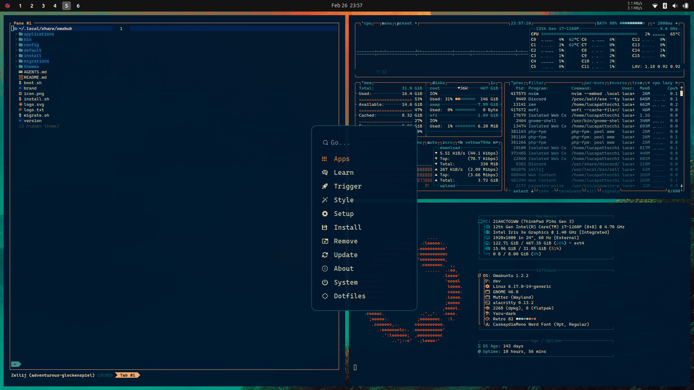

# Omakasui Retro 82 Theme

Retro-futurist Omakasui theme with a deep navy base, warm amber highlights, and cyan/teal support tones.

Attribution:
- The theme was created and packaged by [@OldJobobo](https://github.com/OldJobobo).
- Palette inspiration and feedback by [@niraletter](https://github.com/niraletter).



## Install

Install from GitHub:

```bash
omakub-theme-install https://github.com/omakasui/omakasui-retro-82-theme
```

## Donate

- If you enjoy what [@OldJobobo](https://github.com/OldJobobo) does, consider supporting him on Ko-fi: <https://ko-fi.com/oldjobobo>
